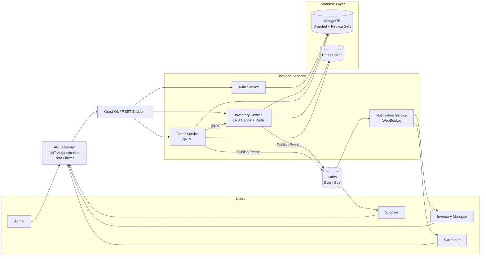

# 🏪 Mini-Inventory Management System

A production-ready, microservices-based inventory management system built with modern technologies and best practices.

## 🎯 Features

- **Microservices Architecture** - Scalable, independent services
- **MongoDB Replica Set** - High availability with automatic failover
- **GraphQL API** - Efficient data fetching for frontend
- **gRPC Communication** - High-performance inter-service communication
- **Event-Driven** - Kafka for asynchronous event processing
- **Redis Caching** - LRU cache for recently visited products
- **Real-time Notifications** - WebSocket for instant updates
- **Role-Based Access Control** - 4 distinct user roles
- **Beautiful UI** - Modern React frontend with shadcn/ui

## 🏗️ Architecture



## 🛠️ Technology Stack

### Backend
- **Node.js** - Runtime environment
- **Express.js** - API Gateway
- **Apollo Server** - GraphQL server
- **gRPC** - Inter-service communication
- **MongoDB** - Primary database (Replica Set)
- **Redis** - Caching layer
- **Kafka** - Event streaming
- **Socket.io** - WebSocket server
- **JWT** - Authentication

### Frontend
- **React 18** - UI framework
- **Vite** - Build tool
- **Apollo Client** - GraphQL client
- **Zustand** - State management
- **shadcn/ui** - UI components
- **Tailwind CSS** - Styling
- **Recharts** - Data visualization

### DevOps
- **Docker** - Containerization
- **Docker Compose** - Local orchestration

## 📋 Prerequisites

- **Node.js** 20+ 
- **MongoDB** 7+ (Community Edition)
- **npm** or **yarn**

**Optional (for full setup):**
- **Docker** & **Docker Compose** (for easy deployment)
- **Redis** (for caching - Phase 3+)
- **Apache Kafka** (for events - Phase 5+)

## 🚀 Quick Start

### Option 1: Local Setup (Recommended for Development)

**Perfect for learning and development without Docker complexity.**

📖 **[Follow the detailed LOCAL_SETUP.md guide](./LOCAL_SETUP.md)**

**Quick steps:**
```bash
# 1. Install MongoDB locally
# Download from: https://www.mongodb.com/try/download/community

# 2. Install dependencies
npm install
cd database && npm install && cd ..

# 3. Copy environment file
copy .env.example .env

# 4. Initialize database
cd database
npm run init
npm run seed
cd ..

# 5. Verify
mongosh inventory --eval "db.products.countDocuments()"
```

### Option 2: Docker Setup (For Production-like Environment)

**Use this when you want to test replica sets, Kafka, and full microservices.**

See [Docker Setup Guide](#docker-setup) below.

---

## 🚀 Quick Start - Phase 1 (Local)

### Step 1: Install MongoDB

Download and install MongoDB Community Edition:
- **Windows**: https://www.mongodb.com/try/download/community
- Install as a Windows Service
- Verify: `mongosh --version`

### Step 2: Install Dependencies

```bash
# Navigate to project directory
cd c:\Users\vyask\Desktop\Invetory

# Install root dependencies
npm install

# Install database dependencies
cd database
npm install
cd ..
```

### Step 3: Configure Environment

```bash
# Copy example environment file
copy .env.example .env

# The default values should work for local setup
```

### Step 4: Initialize Database

```bash
# Make sure MongoDB is running
net start MongoDB

# Initialize database and create indexes
cd database
npm run init

# Seed database with test data
npm run seed
cd ..
```

### Step 5: Verify Setup

```bash
# Connect to MongoDB
mongosh

# In MongoDB shell:
use inventory
db.users.countDocuments()      # Should return 9
db.products.countDocuments()   # Should return 53
db.orders.countDocuments()     # Should return 10
exit
```

---

## 🐳 Docker Setup (For Later)

The `docker-compose.yml` file is ready for when you want to run the full stack with:
- MongoDB Replica Set (3 nodes)
- Redis Cache
- Kafka + Zookeeper

**To use Docker later:**
```bash
# Start all services
docker-compose up -d

# Check status
docker-compose ps

# View logs
docker-compose logs -f

# Stop all services
docker-compose down
```

## 📊 Seeded Test Data

After running the seed script, you'll have:

### 👥 Users (Password: `password123` for all)

| Role | Email | Access |
|------|-------|--------|
| **Admin** | admin@inventory.com | Full system access |
| **Inventory Manager** | manager@inventory.com | Stock management, alerts |
| **Customer** | customer@test.com | Browse, order products |
| **Customer** | customer2@test.com | Browse, order products |
| **Supplier 1-5** | supplier1-5@supply.com | Product supply, stock requests |

### 📦 Products
- **50+ products** across 6 categories
- Categories: Electronics, Clothing, Books, Home & Kitchen, Sports, Toys
- **5 low-stock items** for testing alerts
- Each product has SKU, price, stock, images

### 🛒 Orders
- **10 sample orders** with various statuses
- Order statuses: PENDING, CONFIRMED, PROCESSING, SHIPPED, DELIVERED

## 🔧 Configuration

All configuration is in `.env` file:

```env
# MongoDB
MONGO_URI=mongodb://mongo-primary:27017,mongo-secondary-1:27018,mongo-secondary-2:27019/inventory?replicaSet=rs0

# Redis
REDIS_HOST=localhost
REDIS_PORT=6379

# Kafka
KAFKA_BROKERS=localhost:9093

# JWT
JWT_SECRET=your-super-secret-jwt-key-change-in-production
JWT_EXPIRES_IN=7d

# Service Ports
GATEWAY_PORT=3000
AUTH_SERVICE_PORT=4001
INVENTORY_SERVICE_PORT=4002
ORDER_SERVICE_PORT=4003
NOTIFICATION_SERVICE_PORT=4004
```

## 📁 Project Structure

```
mini-inventory/
├── docker-compose.yml          # Docker services configuration
├── package.json                # Root package with workspaces
├── .env                        # Environment variables
│
├── database/                   # Database scripts
│   ├── mongo-init.js          # Initialize replica set & indexes
│   └── seed.js                # Seed test data
│
├── api-gateway/               # API Gateway (Phase 2)
├── services/                  # Microservices (Phase 2-5)
│   ├── auth-service/
│   ├── inventory-service/
│   ├── order-service/
│   └── notification-service/
│
└── client/                    # React frontend (Phase 6)
```

## 🧪 Testing Phase 1

### Verify MongoDB Replica Set

```bash
# Check replica set status
docker exec -it mongo-primary mongosh --eval "rs.status()" | grep -E "name|stateStr"

# Expected output:
# Primary: mongo-primary:27017 (PRIMARY)
# Secondary: mongo-secondary-1:27018 (SECONDARY)
# Secondary: mongo-secondary-2:27019 (SECONDARY)
```

### Verify Collections and Indexes

```bash
# List collections
docker exec -it mongo-primary mongosh inventory --eval "db.getCollectionNames()"

# Check indexes on products
docker exec -it mongo-primary mongosh inventory --eval "db.products.getIndexes()"

# Count documents
docker exec -it mongo-primary mongosh inventory --eval "
  print('Users:', db.users.countDocuments());
  print('Products:', db.products.countDocuments());
  print('Orders:', db.orders.countDocuments());
"
```

### Query Sample Data

```bash
# Get all users by role
docker exec -it mongo-primary mongosh inventory --eval "
  db.users.find({}, {email: 1, role: 1, name: 1, _id: 0}).forEach(printjson)
"

# Get low stock products
docker exec -it mongo-primary mongosh inventory --eval "
  db.products.find(
    { \$expr: { \$lt: ['\$stock', '\$lowStockThreshold'] } },
    { sku: 1, name: 1, stock: 1, lowStockThreshold: 1, _id: 0 }
  ).forEach(printjson)
"

# Get products by category
docker exec -it mongo-primary mongosh inventory --eval "
  db.products.aggregate([
    { \$group: { _id: '\$category', count: { \$sum: 1 } } },
    { \$sort: { count: -1 } }
  ]).forEach(printjson)
"
```

### Test Redis

```bash
# Test Redis connection
docker exec -it redis-cache redis-cli ping
# Expected: PONG

# Set and get a test key
docker exec -it redis-cache redis-cli SET test "Hello Redis"
docker exec -it redis-cache redis-cli GET test
# Expected: "Hello Redis"
```

### Test Kafka

```bash
# List Kafka topics (will be empty initially)
docker exec -it kafka kafka-topics --bootstrap-server localhost:9092 --list

# Create a test topic
docker exec -it kafka kafka-topics --bootstrap-server localhost:9092 --create --topic test-topic --partitions 1 --replication-factor 1

# Verify topic creation

```bash
# Check logs
docker-compose logs mongo-primary

# Manually initialize (if needed)
docker exec -it mongo-primary mongosh --eval "
  rs.initiate({
    _id: 'rs0',
    members: [
      { _id: 0, host: 'mongo-primary:27017', priority: 2 },
      { _id: 1, host: 'mongo-secondary-1:27018' },
      { _id: 2, host: 'mongo-secondary-2:27019' }
    ]
  })
"
```

### Connection Refused Errors

```bash
# Wait for services to be healthy
docker-compose ps

# Restart services
docker-compose restart

# Check if ports are available
netstat -an | findstr "27017 6379 9092"
```

### Seed Script Fails

```bash
# Ensure MongoDB is ready
docker exec -it mongo-primary mongosh --eval "rs.status()" | grep PRIMARY

# Clear and re-seed
cd database
npm run seed
```

## 📚 Next Steps

1. ✅ **Verify Phase 1** - Ensure all Docker services are running
2. ✅ **Check seed data** - Verify users, products, and orders are created
3. 📝 **Move to Phase 2** - Build Auth Service and API Gateway
4. 📝 **Continue incrementally** - Test each phase before proceeding

## 🤝 Contributing

This is a learning project demonstrating microservices architecture and system design concepts.

## 📄 License

ISC

---

**Built with ❤️ for learning advanced system design concepts**
